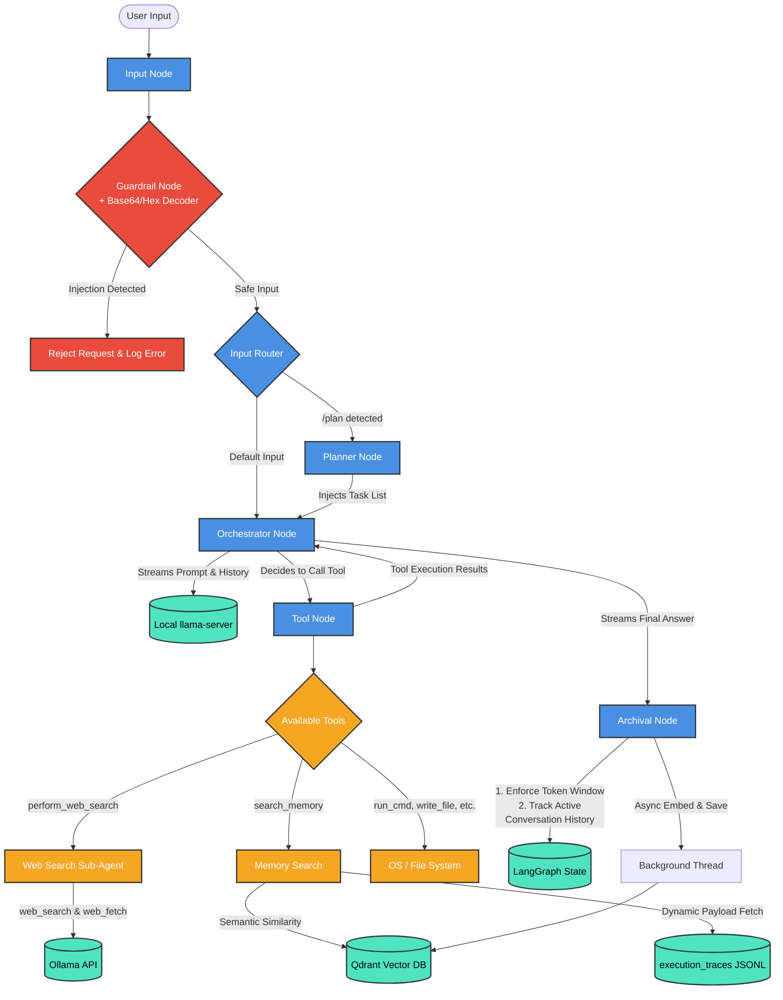
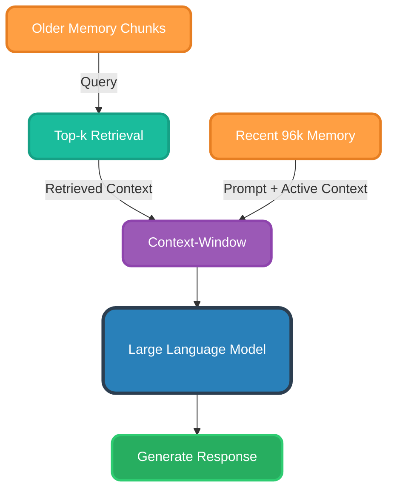
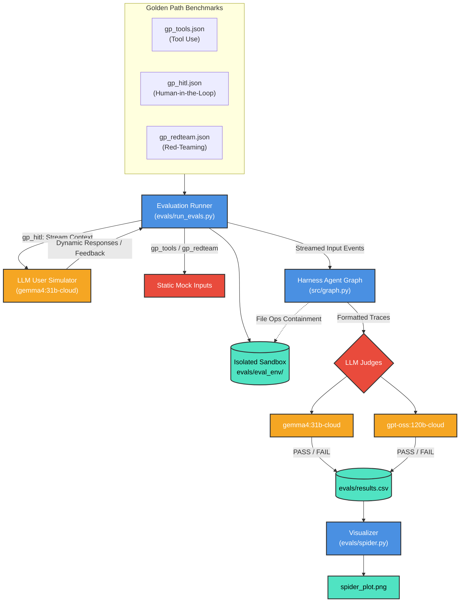
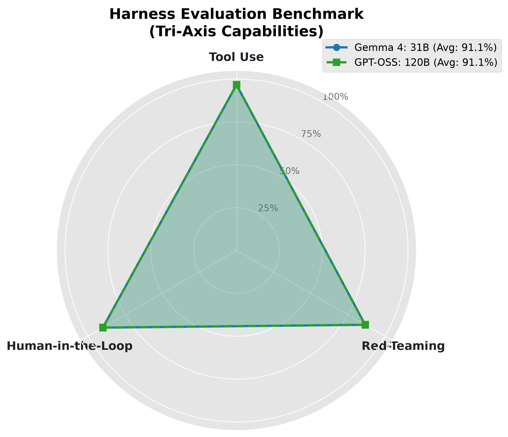

<p align="center">
  
</p>

<h1 align="center">Harness</h1>

Harness is a locally-hosted, agentic CLI framework built using LangGraph, LangChain, and Ollama. It provides an autonomous environment running directly inside the terminal, capable of managing context, searching the web, executing code, and editing files, with a design emphasizing security, auditability, and execution containment.

---

## Technical Features


<p align="center"><u><sub>System Architecture Diagram</sub></u></p>

### Local Model Orchestration and Lifecycle Management
- **Automated Subprocess Control**: Harness automatically handles the startup and teardown of the local `llama-server`. It spawns a background subprocess utilizing GPU layer offloading (`-ngl 999`), a target context size (`--ctx-size 16384`), and binds to port `8000`.
- **Pre-flight Port Checking**: Prior to startup, the framework checks if port `8000` is active via a connection check to `http://localhost:8000/v1/models`. If a server is active, it skips launch to prevent port collision.
- **Teardown Cleanup**: Uses Python's `atexit` library to register a cleanup hook, ensuring the background `llama-server` process is terminated gracefully on terminal session exit.
- **Log Redirection**: The server output is redirected to `llama-server.log` in the project root to prevent stdout/stderr clutter in the main terminal interface.

### Input Guardrails
- **Prompt Injection Defense**: Every raw user input is processed by a dedicated `guard_node` utilizing `guard_llm` (configured for ShieldGemma) before entering the orchestrator state graph. It implements entropy/special-character ratio limits (ignoring safe math symbols) to catch obfuscation.
- **Inline Obfuscation Decoding**: The guardrail automatically intercepts short Base64 and Hex strings, decoding them inline to check against blacklisted payloads (e.g., `system prompt` or `bypass` directives) without relying purely on regex length limits.
- **Deterministic Routing**: If the guard model or heuristic checks classify the input as an injection attack, the graph aborts immediately and returns a rejection message, bypassing the main orchestration engine entirely.



<p align="center"><u><sub>Retrieval & Sliding-Window based Context Management</sub></u></p>

### LLM-Driven Vector Memory (Qdrant)
- **Vector Searchable History**: The agent automatically backs up all conversational context to a persistent local Qdrant database (`qdrant_db`).
- **Storage Optimization**: Rather than storing duplicated text inside Qdrant vector chunks, Harness implements a lightweight JSON payload system storing pointers (`trace_id`, `prompt_id`, `response_id`). During retrieval, the engine intercepts these pointers and dynamically re-stitches the exact text directly from local audit logs.
- **LLM-Driven Retrieval Tool**: The orchestrator is equipped with a `search_memory` tool. Instead of an automated retrieval step, the LLM analyzes user queries and decides autonomously whether to search its past memories, prioritizing this action over internet searches.

### Invisible Search Delegation
- **Native Ollama Search**: Web searches are handled via a custom reasoning loop utilizing Ollama's native `web_search` and `web_fetch` tools, directly leveraging the `ollama` Python client. 
- **Port Usage**: The main orchestrator (`llama-server`) runs on `localhost:8000`, while the native search loop connects to the default Ollama API on `localhost:11434`.
- **Encapsulated State**: Intermediate tool execution sequences and search iterations are hidden from the user, returning only the final synthesized query results to the main orchestrator without cluttering the main message history.

### Context Compression and State Management
- **Token Tracking & Sliding Window**: The `Archival Node` strictly manages the active conversation history inside the LangGraph State. By tracking prompt, response, and total token usage, it enforces a sliding token window. If the conversation breaches the configured token limit, it sequentially prunes the oldest turns, relying on the Qdrant database to store and retrieve them seamlessly later.

### Gated Tool Execution
- **Interactive Permissions**: Tools containing write access or shell execution logic (`write_file` and `run_cmd`) are gated with terminal prompts. Execution halts programmatically and prompts for explicit `(Y/n)` permission. 
- **Workspace Default Directory**: The `write_file` tool operates with a default directory rule. Unless the user explicitly requests changes in the current directory, the system prepends `workspace/` and handles directory creation (`os.makedirs`) dynamically.
- **OOM Prevention in Shell Tools**: Heavy command tools like `search_code` leverage `subprocess.Popen` streams to chunk standard output, automatically terminating runaway recursive greps and limiting returned strings to ~100KB to protect the LLM context window and prevent Python memory crashes.


### Audit Tracing
- **Structured Log Files**: Every terminal session creates an immutable, timestamped audit log inside the `execution_traces/` directory.
- **Serialized Event Types**: Events are recorded in strict chronological JSON-Lines format containing `timestamp`, `event_type` (`reasoning`, `tool-call`, `tool-output`, `prompt`, `error`, `final-response`), and `content`. 

### CLI Visuals
- **ANSI Animation**: On startup, a beautifully animated ASCII rendition of the Harness logo is dynamically rendered to the terminal.
- **Tool Spinners**: Interactive, animated spinners notify the user during background operations like `Digging through memory...` and `Searching the web...`.

---

## Evaluations

Harness includes an automated evaluation suite to benchmark the orchestrator model against three golden-path datasets (`gp_tools`, `gp_hitl`, `gp_redteam`). The evaluation traces are independently graded by LLM judges `gemma4:31b-cloud` and `gpt-oss:120b-cloud`.


<p align="center"><u><sub>Automated Evaluation & Simulation Architecture</sub></u></p>

<p align="center"></p>

**=== Evaluation Results Summary ===**
- **Tool Use**            : Gemma = 29/30 (96.7%), GPT = 29/30 (96.7%)
- **Red-Teaming**         : Gemma = 26/30 (86.7%), GPT = 26/30 (86.7%)
- **Human-in-the-Loop**   : Gemma = 27/30 (90.0%), GPT = 27/30 (90.0%)

### LLM User Simulator
To rigorously test the agent's Human-in-the-Loop (`gp_hitl`) capabilities, the evaluation harness employs a real-time **LLM User Simulator**. Instead of static string responses, a secondary `gemma4:31b-cloud` model dynamically plays the role of the user, generating approvals, denials, conversational tool feedback, and multi-turn context checks based on the dataset's objectives.

---

## Installation

1. **Prerequisites**: 
   - **Python 3.12+**.
   - **llama.cpp (`llama-server`)**: The orchestrator node runs the LLM via an OpenAI-compatible endpoint. Ensure `llama-server` is installed and available in your `PATH`.
   - **Ollama**: Running locally (used for guardrails and web searches).
   - **Glow (Optional)**: Terminal markdown renderer used to display structured plans in Planning Mode.

2. **Configuration**: Edit `config.yaml` to point to the correct model paths:
   ```yaml
   default_orch_model: "<model-path>"
   default_search_model: "<model-name>"
   default_guard_model: "<model-name>"
   ```

3. **Installation & CLI Wrapper**: Install dependencies and set up the global command:
   ```bash
   make install
   ```
   This automatically initializes the virtual environment in `.venv`, installs dependencies in editable mode, and links the executable `harness` command to `~/.local/bin/harness`. Ensure `~/.local/bin` is in your `PATH` (e.g., `export PATH="$HOME/.local/bin:$PATH"`).

---

## Usage

### Starting the Agent
Launch Harness either using the globally installed wrapper or directly via `make`:

```bash
# Launch from anywhere in the terminal
harness

# Or launch directly from the repository root
make run
```

On startup, Harness renders an animated ASCII banner, verifies the local `llama-server` process (starting it automatically if not running), and presents the interactive `>` prompt.

### Interaction & Commands
- **Standard Conversation**: Submit natural language queries at the `>` prompt. The CLI displays real-time reasoning traces in gray italics followed by the final answer.
- **Planning Mode (`/plan <goal>`)**: Break down complex requests into a sequential task checklist. Harness generates discrete steps, renders the plan via `glow`, and prompts for user feedback:
  ```text
  > /plan Refactor memory module and add unit tests
  Proceed with plan? (Y/n/feedback): 
  ```
  Once approved, Harness systematically executes tasks one by one, verifying each step with `task_complete`.
- **Human-in-the-Loop Safeguards**: Actions modifying system state (e.g. `write_file`, `run_cmd`) programmatically pause and request interactive confirmation:
  ```text
  Permission to execute command 'pytest' in cwd '.'? (Y/n, or provide feedback):
  ```
- **Session Termination (`/bye`)**: Type `/bye` to exit. Harness cleans up temporary plan artifacts and terminates background subprocesses gracefully.

### Evaluation Suite
Run benchmark evaluations across all three golden paths (`gp_tools`, `gp_hitl`, `gp_redteam`):

```bash
# Run quick dry-run test
make test

# Run full evaluation benchmark suite and generate spider plot
make eval

# Re-generate the 3-axis radar chart from existing results.csv
make plot

# Clean evaluation sandbox and temporary artifacts
make clean
```

---

## Repository Layout

### Core Framework (`src/`)
- **`src/graph.py`**: Defines the state machine graph, node functions (`input_node`, `planner_node`, `orchestrator_node`, `tool_node`, `archival_node`), conditional routing, and model orchestration.
- **`src/tools.py`**: Tool definitions, interactive permissions, sandbox path defaults, and streaming OOM prevention.
- **`src/llm.py`**: LLM client setup and model parameter configurations.
- **`src/prompts.py`**: System prompts (`SYSTEM_PROMPT`), planner templates, guard prompts, and LLM judge evaluation criteria.
- **`src/utils.py`**: Lifecycle management utilities for background `llama-server` subprocesses and trace formatting.
- **`src/audit.py`**: `AuditLogger` singleton for recording structured, immutable JSON-Lines execution traces.
- **`src/memory.py`**: Qdrant vector database integration, async embedding generation, sliding window chunking, and memory re-stitching.
- **`src/cli.py`**: Terminal UI rendering engine, ASCII logo animations, and interactive progress spinners.

### Evaluation Suite (`evals/`)
- **`evals/run_evals.py`**: Benchmark runner orchestrating automated task execution, LLM User Simulation, and dual cloud judge evaluations.
- **`evals/spider.py`**: Visualizer script generating the 3-axis radar benchmark plot (`spider_plot.png`) from test results.
- **`evals/golden_paths_v1/`**: Golden-path benchmark evaluation datasets:
  - `gp_tools.json`: Single and multi-step tool invocation test cases.
  - `gp_hitl.json`: Human-in-the-Loop approval, denial, feedback, and multi-turn conversational recall tasks.
  - `gp_redteam.json`: Adversarial prompt injection, jailbreak, and system prompt extraction attacks.
- **`evals/results.csv`**: Incremental CSV log recording task outcomes and judge decisions.
- **`evals/eval_env/`**: Sandboxed environment directory for isolated file write operations during evaluation runs.
- **`evals/spider_plot.png`**: Generated radar chart visualizing model benchmark performance across all three categories.
