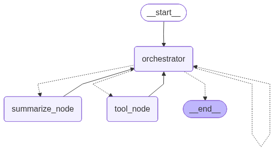

<p align="center">
  
</p>

<h1 align="center">Harness</h1>

Harness is a locally-hosted, agentic CLI framework built using LangGraph, LangChain, and Ollama. It provides an autonomous environment running directly inside the terminal, capable of managing context, searching the web, executing code, and editing files, with a design emphasizing security, auditability, and execution containment.

---

## Technical Features

### Local Model Orchestration and Lifecycle Management
- **Automated Subprocess Control**: Harness automatically handles the startup and teardown of the local `llama-server`. It spawns a background subprocess utilizing GPU layer offloading (`-ngl 999`), a target context size (`--ctx-size 16384`), and binds to port `8000`.
- **Pre-flight Port Checking**: Prior to startup, the framework checks if port `8000` is active via a connection check to `http://localhost:8000/v1/models`. If a server is active, it skips launch to prevent port collision.
- **Teardown Cleanup**: Uses Python's `atexit` library to register a cleanup hook, ensuring the background `llama-server` process is terminated gracefully on terminal session exit.
- **Log Redirection**: The server output is redirected to `llama-server.log` in the project root to prevent stdout/stderr clutter in the main terminal interface.

### Input Guardrails
- **Prompt Injection Defense**: Every raw user input is processed by a dedicated `guard_node` utilizing `guard_llm` (configured for ShieldGemma) before entering the orchestrator state graph. 
- **Deterministic Routing**: If the guard model classifies the input as an injection attack, the graph aborts immediately and returns a rejection message, bypassing the main orchestration engine entirely.

### Invisible Search Delegation
- **Sub-Agent Offloading**: Web searches are offloaded to an isolated LangGraph React sub-agent (`search_llm`) equipped with DuckDuckGo and Tavily tools.
- **Encapsulated State**: The sub-agent runs with a clean, stateless configuration to keep the main message history minimal. Intermediate tool execution sequences and search iterations are hidden from the user, returning only the final synthesized query results to the main orchestrator.

### Gated Tool Execution
- **Interactive Permissions**: Tools containing write access or shell execution logic (`write_file` and `run_cmd`) are gated with terminal prompts. Execution halts programmatically and prompts for explicit `(Y/n)` permission. 
- **Workspace Default Directory**: The `write_file` tool operates with a default directory rule. Unless the user explicitly requests changes in the current directory, the system prepends `workspace/` and handles directory creation (`os.makedirs`) dynamically.

### Context Compression and State Management
- **Token Tracking**: Harness tracks prompt, response, and total token usage inside its LangGraph State representation.
- **Summarization Threshold**: When token count exceeds 90% of the maximum model context (configured via `SUMMARIZE_AT`), the execution state routes to `summarize_node`. The history is compressed into a structural brief (including task description, key context, and ignored items) using an optimization LLM, pruning redundant system logs to optimize context window space.

### Audit Tracing
- **Structured Log Files**: Every terminal session creates an immutable, timestamped audit log inside the `execution_traces/` directory.
- **Serialized Event Types**: Events are recorded in JSON-Lines format containing `timestamp`, `event_type` (`prompt`, `reasoning`, `tool-call`, `tool-output`, `error`, `final-response`), and `content`. Tool-call events record the exact function name and arguments invoked.

---

## Installation

1. **Prerequisites**: Python 3.12+ and Ollama running locally.
2. **Environment Setup**: Set up your Python virtual environment in the `.venv` directory and run dependencies setup.
3. **Configuration**: Edit `config.yaml` to point to the correct model paths:
   ```yaml
   default_orch_model: "~/models/gemma-4/e4b-it.gguf"
   default_search_model: "llama3.2:3b"
   default_guard_model: "shieldgemma:2b"
   default_opt_model: "minimax-m3:cloud"
   ```
4. **Command CLI Wrapper**: Install the CLI utility by running the setup script from the root directory:
   ```bash
   ./install.sh
   ```
   This generates a wrapper script at `~/.local/bin/harness` that handles path resolution, virtual environment activation, and configuration loading.

---

## Usage

Run the global CLI command from any terminal directory:
```bash
harness
```

- Submit queries at the `>` input prompt.
- The CLI displays the orchestrator's reasoning trace in gray italics followed by the final output.
- When background web search is running, the terminal displays `Searching the web...` in italics.
- Type `/bye` to exit the CLI session and terminate background processes.

---

## Architecture

- **`src/graph.py`**: Defies the state machine graph, node functions, edge routing, and automated background model processes.
- **`src/tools.py`**: Implementation of permissions, workspace defaults, and the React sub-agent definition.
- **`src/llm.py`**: LLM instances initialization and setup parameters.
- **`src/audit.py`**: Contains the `AuditLogger` singleton handling the write logic for structured JSON logs.

### Graph Visualization
<p align="center">
  
</p>
